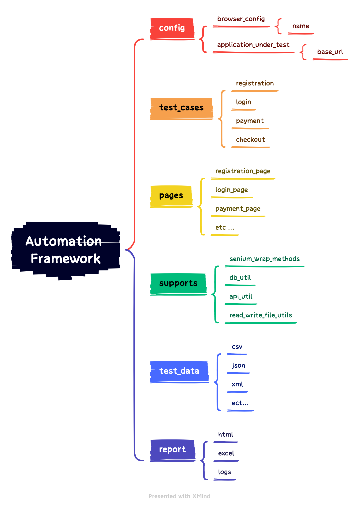

# Automation Test Framework for Browser
----

## Setting up


1. Java JDK 11
2. Maven 3.9
3. Chrome 102
4. Chromedriver

## How to run

1. local

    ```
    $ mvn clean test
    ```
2. ci - [Github Action](https://github.com/cuhavp/ak36/actions)

## Structure

